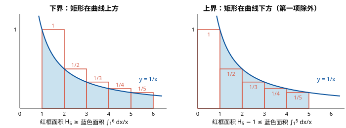

# 第一章作业 参考答案

> 约定：本文中 $\log$ 若不特别说明均以 2 为底（渐近意义下底数不影响结果）。

**三个记号的直观含义**（都是在 $n$ 充分大、忽略常数倍的意义下）：

| 记号 | 直观含义 | 定义 |
|---|---|---|
| $f = O(g)$ | $f$ **不超过** $g$ 的量级（上界） | 存在 $c > 0, n_0$，使 $n \ge n_0$ 时 $f(n) \le c\,g(n)$ |
| $f = \Omega(g)$ | $f$ **不低于** $g$ 的量级（下界） | 存在 $c > 0, n_0$，使 $n \ge n_0$ 时 $f(n) \ge c\,g(n)$ |
| $f = \Theta(g)$ | $f$ 与 $g$ **同阶**（紧确界） | 同时满足 $O$ 和 $\Omega$ |

注意：$O$ / $\Omega$ 只是"上界 / 下界"，与"最坏情况 / 最好情况"是两回事——最坏情况运行时间同样可以用 $O$、$\Omega$、$\Theta$ 来描述。

## 1

1. $\sum_{i=1}^{n} \frac{1}{i} = \Theta(\log n)$。

   直观：把每一项 $\frac1i$ 看成宽为 1、高为 $\frac1i$ 的小矩形，这些矩形拼起来的面积与曲线 $y = \frac1x$ 下的面积 $\int_1^n \frac{dx}{x} = \ln n$ 只差一个常数。严格地，记 $H_n = \sum_{i=1}^n \frac1i$，由积分估计：

   $$\ln(n+1) = \int_1^{n+1}\frac{dx}{x} \le H_n \le 1 + \int_1^{n}\frac{dx}{x} = 1 + \ln n .$$

   

   两边都只用到一个事实：$\frac1x$ 单调递减，所以矩形放在区间的哪一端，决定了它在曲线上方还是下方。

   - **下界（左图）**：把 $\frac1i$ 对应的矩形放在 $[i,\ i+1]$ 上。区间内 $x \ge i$，故 $\frac1x \le \frac1i$，曲线在矩形下方：$\int_i^{i+1}\frac{dx}{x} \le \frac1i$。对 $i = 1, \dots, n$ 求和，各段积分拼成 $[1, n+1]$，得 $\ln(n+1) \le H_n$。
   - **上界（右图）**：把 $\frac1i$ 对应的矩形放在 $[i-1,\ i]$ 上。当 $i \ge 2$ 时，区间内 $x \le i$，故 $\frac1x \ge \frac1i$，矩形在曲线下方：$\frac1i \le \int_{i-1}^{i}\frac{dx}{x}$。对 $i = 2, \dots, n$ 求和得 $H_n - 1 \le \int_1^n \frac{dx}{x} = \ln n$。第一项 $\frac11$ 不能这样估计（$\int_0^1 \frac{dx}{x}$ 发散），单独加上，得 $H_n \le 1 + \ln n$。

   上下界都是 $\ln n$ 量级，故 $H_n = \Theta(\log n)$。验证 $n = 3$：$\ln 4 \approx 1.386 \le H_3 \approx 1.833 \le 1 + \ln 3 \approx 2.099$。

2. $\log(n!) = \Theta(n \log n)$。

   $\log(n!) = \log 1 + \log 2 + \cdots + \log n$，共 $n$ 项，分别找"天花板"和"地板"：

   - 上界（每项都放大成最大的 $\log n$）：$\log(n!) = \sum_{i=1}^n \log i \le n\log n$。
   - 下界（扔掉前一半，只留后一半，后一半至少 $\frac n2$ 项、每项都 $\ge \log\frac n2$）：$\log(n!) \ge \sum_{i=\lceil n/2\rceil}^{n}\log i \ge \frac n2 \log\frac n2$。当 $n \ge 4$ 时 $\frac n2 \ge \sqrt n$，故 $\log\frac n2 \ge \frac12\log n$，从而 $\log(n!) \ge \frac n4\log n = \Omega(n\log n)$。

   上下界同为 $n\log n$ 量级，故为 $\Theta(n\log n)$。（更精确的结果见文末附录 B 的 Stirling 公式：$\ln(n!) = n\ln n - n + O(\log n)$。）

3. $f(n) = \Omega(g(n))$ 且 $f(n) = O(g(n))$ 等价于 $f(n) = \Theta(g(n))$。

   直观：$f$ 既不低于 $g$ 的量级，又不超过 $g$ 的量级，只能与 $g$ 同阶。这正是 $\Theta$ 的定义。

4. $2026^n = \Omega(2025^n)$。

   因为 $\frac{2026^n}{2025^n} = \left(\frac{2026}{2025}\right)^n \approx 1.000494^n \to \infty$——底数哪怕只大一点点，比值也会随 $n$ 指数增长，没有常数能罩住，所以 $2026^n \ne O(2025^n)$，从而也不是 $\Theta$；而 $2026^n \ge 2025^n$ 恒成立，故只能填 $\Omega$。（参见第 4.1 题。）

## 2

**答案：$O(n)$（实际上是 $\Theta(n)$）。**

**先看为什么直觉上的 $O(n\log n)$ 不紧。** 若内层每次都从 $j = 1$ 翻倍到 $n$，那确实是 $n \times \log n$。但这里内层从 $j = i$ 开始：$i$ 越大，翻倍几次就超过 $n$ 了。例如 $i > n/2$ 时，$j = i$ 执行一次后 $j = 2i > n$，内层**只执行 1 次**——整整一半的 $i$ 都是这样。

**换个角度数（按"第几步"数，而不是按"哪个 $i$"数）：**

- 能执行第 1 步（$j = i \le n$）的 $i$：$1 \sim n$，共 $n$ 个；
- 能执行第 2 步（$j = 2i \le n$）的 $i$：$1 \sim \lfloor n/2 \rfloor$，共 $\lfloor n/2\rfloor$ 个；
- 能执行第 3 步（$j = 4i \le n$）的 $i$：$1 \sim \lfloor n/4 \rfloor$，共 $\lfloor n/4\rfloor$ 个；
- ……

全部加起来：$\text{cnt} = n + \lfloor n/2\rfloor + \lfloor n/4\rfloor + \cdots < 2n$。

**严格推导：** 对固定的 $i$，内层循环中 $j$ 依次取 $i, 2i, 4i, \dots, 2^k i$，只要 $2^k i \le n$ 就执行一次 `cnt++`。所以外层取 $i$ 时，内层执行次数为

$$
t(i) = \#\{\,k \ge 0 : 2^k i \le n\,\} = \left\lfloor \log_2 \frac{n}{i} \right\rfloor + 1 .
$$

总次数 $\displaystyle \text{cnt} = \sum_{i=1}^{n} t(i)$。交换求和次序（就是上面"按第几步数"的思路）：对每个 $k \ge 0$，满足 $2^k i \le n$ 的 $i$ 恰有 $\lfloor n/2^k \rfloor$ 个，因此

$$
\text{cnt} = \sum_{i=1}^{n}\sum_{k \ge 0}[\,2^k i \le n\,] = \sum_{k \ge 0} \left\lfloor \frac{n}{2^k} \right\rfloor \le n\left(1 + \frac12 + \frac14 + \cdots\right) < 2n .
$$

另一方面，和式中 $k=0$ 的一项为 $\lfloor n/2^0 \rfloor = n$（对应每个 $i$ 都至少执行一次内层循环），其余各项均非负，故 $\text{cnt} \ge n$。于是 $n \le \text{cnt} < 2n$，外层循环本身执行 $n$ 次，故时间复杂度为 $\Theta(n)$，即 $O(n)$。

> 注意：说"外层 $n$ 次、内层 $O(\log n)$ 次，所以 $O(n\log n)$"并不算错，但只是一个松的上界，题目要的是推导出紧的结果。
>
> 另一种估算：$\text{cnt} = \sum_{i=1}^n t(i) \le \sum_{i=1}^n \left(\log_2\frac ni + 1\right) = n + n\log_2 n - \log_2(n!) = n + n\log_2 e + O(\log n) = O(n)$（Stirling 公式，见附录 B）。

## 3

1. $T(n) = n^5 \times 3^n + 4^n = \Theta(4^n)$。

   直观：底数更大的指数函数压倒一切多项式因子。严格地，$\frac{n^5 3^n}{4^n} = n^5 (3/4)^n \to 0$（$(3/4)^n$ 指数衰减，$n^5$ 救不回来），故 $4^n \le T(n) \le 2\cdot 4^n$（$n$ 充分大时）。

2. $T(n) = T(n-1) + \Theta(n)$ ⟹ $T(n) = \Theta(n^2)$。

   直观：规模每次只减 1，每步代价与当前规模成正比，即 $n + (n-1) + \cdots + 1$，和选择排序的比较次数一样。展开：$T(n) = T(1) + \sum_{k=2}^{n}\Theta(k) = \Theta\!\left(\frac{n(n+1)}{2}\right) = \Theta(n^2)$。

3. $T(n) = T(\lfloor n/2 \rfloor) + \Theta(1)$ ⟹ $T(n) = \Theta(\log n)$。

   直观：每次把问题砍掉一半、只花常数时间，就是二分查找。递归深度为 $\lfloor \log_2 n\rfloor + 1$，每层 $\Theta(1)$。（也可由主定理 $a=1,b=2,f(n)=\Theta(1)=\Theta(n^{\log_b a})$ 得到，见附录 A 例 1。）

4. $T(n) = T(n-1) + \Theta(\log n)$ ⟹ $T(n) = \Theta(n \log n)$。

   展开：$T(n) = T(1) + \sum_{k=2}^{n}\Theta(\log k) = \Theta(\log n!) = \Theta(n\log n)$（由第 1.2 题）。

## 4

### 4.1 证明：对任意正实数 $a, b$，$a^n = O(b^n) \iff a \le b$。

**思路：** "⇐"几乎是显然的（$c = 1$ 就够）；"⇒"用反证法：若 $a > b$，比值 $(a/b)^n$ 是大于 1 的数的 $n$ 次方，会无限增长，没有常数 $c$ 能罩住它，与 $O$ 的定义矛盾。

**（⇐）** 若 $a \le b$，由 $a, b > 0$ 得对所有 $n \ge 1$ 有 $a^n \le b^n$。取 $c = 1, n_0 = 1$ 即满足 $O$ 的定义，所以 $a^n = O(b^n)$。

**（⇒）** 用反证法。假设 $a^n = O(b^n)$ 但 $a > b$。由定义存在常数 $c > 0$ 和 $n_0$，使得对所有 $n \ge n_0$ 有 $a^n \le c\, b^n$，即

$$
\left(\frac ab\right)^n \le c \quad (n \ge n_0).
$$

令 $r = a/b > 1$，则 $r^n = (1 + (r-1))^n \ge 1 + n(r-1)$（Bernoulli 不等式），取 $n > \max\{n_0, \frac{c}{r-1}\}$ 时 $r^n > c$，矛盾。故 $a \le b$。 ∎

> **这一步在做什么？** 反证假设说 $r^n$ 从 $n_0$ 起被常数 $c$ 封顶；只要找到一个 $n \ge n_0$ 使 $r^n > c$ 就矛盾了。$r^n$ 不好直接算，于是用 Bernoulli 不等式找一个比它小、又好算的下界 $1 + n(r-1)$，让下界超过 $c$。
>
> - **Bernoulli 不等式的来历**：记 $x = r - 1 > 0$，二项式展开 $(1+x)^n = 1 + nx + \binom n2 x^2 + \cdots + x^n$，后面各项都是正的，扔掉只会变小，故 $r^n \ge 1 + nx = 1 + n(r-1)$。右边是关于 $n$ 的一次函数，斜率 $r - 1 > 0$，会无限增长。
> - **$n$ 为什么这样取**：$n > \frac{c}{r-1}$ 保证 $n(r-1) > c$，从而 $r^n \ge 1 + n(r-1) > c$；$n > n_0$ 保证反证假设 $r^n \le c$ 对这个 $n$ 也成立。两者同时成立就产生矛盾。
> - **数值例子**：$a = 3, b = 2$，$r = 1.5$。若声称 $3^n \le 100 \cdot 2^n$（$c = 100$），取 $n > \frac{100}{0.5} = 200$，如 $n = 201$，下界 $1 + 201 \times 0.5 = 101.5 > 100$。Bernoulli 下界很松（$1.5^{201}$ 远大于 100），但只需超过 $c$ 就够了。
> - **为什么不直接写"$r^n \to \infty$"？** 作为直观理解可以；严格证明需要给出具体的 $n$，Bernoulli 不等式正好把它算了出来。学过极限的也可写 $r^n = e^{n\ln r} \to \infty$（因 $\ln r > 0$）。

### 4.2 已知 $T(1)=1$，$T(n) = 2T(\lfloor n/2\rfloor) + n$，证明 $T(n) = O(n\log n)$。

**先看直观（递归树）：** 这是归并排序的递推式。第 0 层代价 $n$；第 1 层 2 个规模 $n/2$ 的子问题，代价 $2 \cdot \frac n2 = n$；第 2 层 4 个规模 $n/4$ 的子问题，代价仍为 $n$……每层代价都约为 $n$，规模每次减半，共约 $\log_2 n$ 层，所以总代价约 $n\log_2 n$。下面用数学归纳法给出严格证明。

**要证：** 对所有 $n \ge 2$，$T(n) \le 2\,n \log_2 n$（取 $c = 2, n_0 = 2$）。

> **常数 $c$ 和 $n_0$ 是怎么选出来的？** 按 $O$ 的定义，必须找出具体的 $c$ 和 $n_0$。
>
> - 为什么不从 $n = 1$ 开始？因为 $c \cdot 1\cdot\log 1 = 0 < T(1) = 1$，无论 $c$ 取多大 $n=1$ 都不成立。$O$ 记号只要求 $n$ 充分大时成立，所以把基础情形放在 $n = 2, 3$。
> - 为什么 $c = 1$ 不行？$T(2) = 2T(1) + 2 = 4$，而 $1 \cdot 2\log_2 2 = 2 < 4$，基础情形就不成立。要罩住 $T(2)$ 需 $c \cdot 2 \ge 4$，即 $c \ge 2$。
> - $c = 2$ 恰好够用：基础情形 $T(2) = 4$ 正好压线，归纳步骤中还多出一个 $-n$ 的余量（见下）。取更大的常数（如 $c = 100$）同样正确，只是没必要。

**基础情形。** $T(2) = 2T(1) + 2 = 4 \le 2\cdot 2\cdot \log_2 2 = 4$；
$T(3) = 2T(1) + 3 = 5 \le 2\cdot 3\cdot\log_2 3 \approx 9.51$。成立。

**归纳步骤。** 设 $n \ge 4$，并假设对所有 $2 \le k < n$ 均有 $T(k) \le 2k\log_2 k$。记 $m = \lfloor n/2 \rfloor$，由 $n\ge 4$ 知 $2 \le m < n$，可用归纳假设；且 $m \le n/2$，所以

$$
\begin{aligned}
T(n) &= 2T(m) + n \le 2\cdot 2m\log_2 m + n \\
     &\le 2n \log_2\frac n2 + n \qquad (\text{因为 } 2m \le n,\ \log_2 m \le \log_2\tfrac n2)\\
     &= 2n\log_2 n - 2n + n \\
     &= 2n\log_2 n - n \\
     &\le 2n\log_2 n .
\end{aligned}
$$

由数学归纳法（强归纳），对所有 $n \ge 2$ 有 $T(n) \le 2n\log_2 n$，即 $T(n) = O(n\log n)$。 ∎

> 补充：下界也成立，因此实际上 $T(n) = \Theta(n\log n)$。注意因为下取整，**不能**直接说 $T(n) \ge n\log_2 n$（例如 $T(7) = 2T(3) + 7 = 17 < 7\log_2 7 \approx 19.65$），但相差只是常数倍。记 $K = \lfloor\log_2 n\rfloor$，利用 $\lfloor\lfloor n/2^k\rfloor/2\rfloor = \lfloor n/2^{k+1}\rfloor$ 把递推式展开 $K$ 次，并注意 $\lfloor n/2^K\rfloor = 1 = T(1)$，得
>
> $$T(n) = \sum_{k=0}^{K} 2^k\left\lfloor\frac{n}{2^k}\right\rfloor .$$
>
> 由 $x \ge 1$ 时 $\lfloor x\rfloor \ge \frac x2$，每一项 $\ge \frac n2$，共 $K + 1 \ge \log_2 n$ 项，故 $T(n) \ge \frac12 n\log_2 n = \Omega(n\log n)$。

---

## 附录 A：主定理（Master Theorem）速查

对分治递推式

$$T(n) = a\,T(n/b) + f(n) \qquad (a \ge 1,\ b > 1)$$

其中 $a$ 是子问题个数，$n/b$ 是每个子问题的规模，$f(n)$ 是划分与合并的代价。

**直观：** 画出递归树，树高 $\log_b n$，第 $h$ 层有 $a^h$ 个结点，于是叶子数为

$$a^{\log_b n} = n^{\log_b a} .$$

（证明：两边取 $\log_b$，左边 $= \log_b n \cdot \log_b a$，右边 $= \log_b a \cdot \log_b n$，相等。例如 $a=4, b=2, n=8$：$4^{\log_2 8} = 4^3 = 64 = 8^2 = 8^{\log_2 4}$。写成 $n^{\log_b a}$ 是为了一眼看出它是 $n$ 的几次方，便于和 $f(n)$ 比较。）

主定理就是比较"叶子总代价 $n^{\log_b a}$"与"根的代价 $f(n)$"谁大：

| 情况 | 条件 | 结论 | 直观 |
|---|---|---|---|
| 1 | $f(n) = O(n^{\log_b a - \varepsilon})$，某 $\varepsilon > 0$ | $T(n) = \Theta(n^{\log_b a})$ | 叶子占主导 |
| 2 | $f(n) = \Theta(n^{\log_b a})$ | $T(n) = \Theta(n^{\log_b a}\log n)$ | 每层代价相当，乘上层数 $\log n$ |
| 3 | $f(n) = \Omega(n^{\log_b a + \varepsilon})$，某 $\varepsilon > 0$，且 $a f(n/b) \le c f(n)$（某常数 $c<1$） | $T(n) = \Theta(f(n))$ | 根占主导 |

注意情况 1、3 要求**多项式级**的差距（差一个 $n^\varepsilon$），例如 $T(n) = 2T(n/2) + n\log n$ 不属于任何一种情况，主定理不能直接用。

**常用简化版：** 若 $f(n) = \Theta(n^d)$，只需比较 $\log_b a$ 与 $d$：

- $\log_b a > d$：$T(n) = \Theta(n^{\log_b a})$；
- $\log_b a = d$：$T(n) = \Theta(n^d \log n)$；
- $\log_b a < d$：$T(n) = \Theta(n^d)$（此时正则条件自动满足）。

**例子：**

| 递推式 | $a, b, d$ | 比较 | 结果 |
|---|---|---|---|
| 二分查找 $T(n) = T(n/2) + \Theta(1)$ | $1, 2, 0$ | $\log_2 1 = 0 = d$ | $\Theta(\log n)$（第 3.3 题） |
| 归并排序 $T(n) = 2T(n/2) + \Theta(n)$ | $2, 2, 1$ | $\log_2 2 = 1 = d$ | $\Theta(n\log n)$（第 4.2 题） |
| Strassen $T(n) = 7T(n/2) + \Theta(n^2)$ | $7, 2, 2$ | $\log_2 7 \approx 2.81 > 2$ | $\Theta(n^{\log_2 7}) \approx \Theta(n^{2.81})$ |
| $T(n) = 2T(n/2) + \Theta(n^2)$ | $2, 2, 2$ | $\log_2 2 = 1 < 2$ | $\Theta(n^2)$ |

注意：第 3.2、3.4 题是 $T(n-1)$ 型（规模减 1 而不是除以 $b$），不能用主定理，只能直接展开求和。

## 附录 B：Stirling 公式

$$n! \approx \sqrt{2\pi n}\left(\frac ne\right)^n .$$

**$\left(\frac ne\right)^n$ 从哪来：** 取对数把乘积变成求和，再用积分近似：

$$\ln(n!) = \sum_{k=1}^n \ln k \approx \int_1^n \ln x\,dx = \big[x\ln x - x\big]_1^n = n\ln n - n + 1 ,$$

于是 $n! \approx e^{n\ln n - n} = \frac{n^n}{e^n}$。分母上的 $e^n$ 来自积分结果中的 $-x$ 项；$\sqrt{2\pi n}$ 是更精细的修正因子。

**算法分析中常用的对数形式：**

$$\ln(n!) = n\ln n - n + O(\log n), \qquad \log_2(n!) = n\log_2 n - n\log_2 e + O(\log n) .$$

首项 $n\log n$ 占主导，所以 $\log(n!) = \Theta(n\log n)$（第 1.2 题）。

**应用：比较排序的下界。** 任何基于两两比较的排序算法都对应一棵决策树，$n$ 个元素的 $n!$ 种排列各对应至少一个叶子，二叉树高度至少 $\lceil\log_2(n!)\rceil = \Omega(n\log n)$。因此任何比较排序在最坏情况下都需要 $\Omega(n\log n)$ 次比较。
